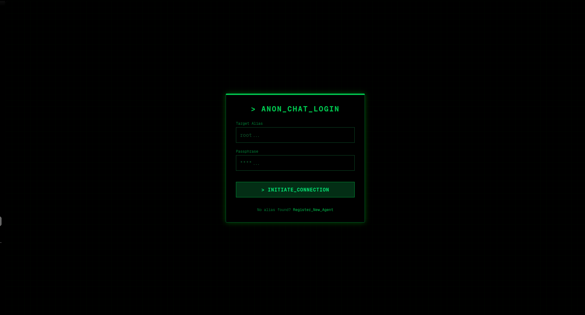
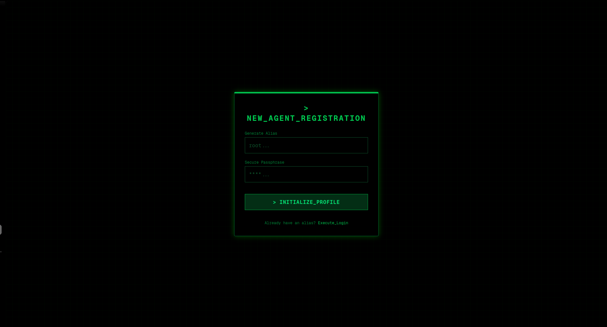
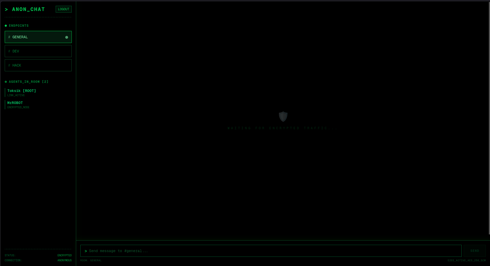
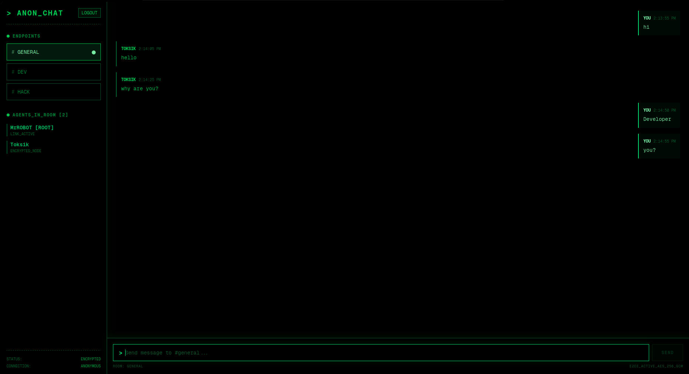

# ANON_CHAT
> TERMINAL-STYLE ANONYMOUS COMMUNICATION INTERFACE

ANON_CHAT is a high-security, real-time anonymous communication platform. It utilizes a Next.js frontend with a Django-based backend powered by WebSockets for instant data synchronization.

---

## INTERFACE_SNAPSHOTS

### AUTHENTICATION_LAYER
The entry point for all agents. Secure login and registration with a terminal-inspired interface.


*Figure 1.0: Security authentication gateway.*


*Figure 1.1: New agent profile initialization.*

### COMMUNICATION_HUB
Multi-room chat environment with real-time status updates and encrypted traffic simulation.


*Figure 2.0: Initializing secure link in #general room.*


*Figure 2.1: Active secure data exchange between multiple nodes.*

---

## CORE_SPECIFICATIONS

### SYSTEM_ARCHITECTURE
- **frontend_node**: Next.js / React / Tailwind CSS
- **backend_core**: Django / REST / Channels (WebSockets)
- **data_storage**: PostgreSQL
- **stream_engine**: Redis (Broker/Cache)
- **deployment_stack**: Docker / Compose / Nginx

### OPERATIONAL_LOGIC
1. **node_initiation**: Frontend connects to Backend via REST for handshake.
2. **secure_socket_establishment**: Django Channels upgrades connection to WebSocket.
3. **data_propagation**: Redis channel layer broadcasts messages to all active room subscribers.
4. **asynchronous_processing**: PostgreSQL handles long-term storage and session management.

---

## DEPLOYMENT_PROCEDURE

### REQUIREMENTS
- Docker Engine
- Docker Compose

### EXECUTION_COMMANDS
1. Clone the repository to your local directory.
2. Initialize environment variables via `.env`.
3. Build and launch the containerized stack:
   ```bash
   docker-compose up --build -d
   ```

### NETWORK_ACCESS_POINTS
- Frontend Interface: [http://localhost:3000](http://localhost:3000)
- Backend Core API: [http://localhost:8000](http://localhost:8000)

---
(C) 2026 ANON_CHAT // SECURED_COMMUNICATION_PROTOCOL
